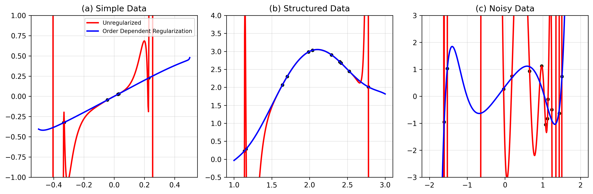
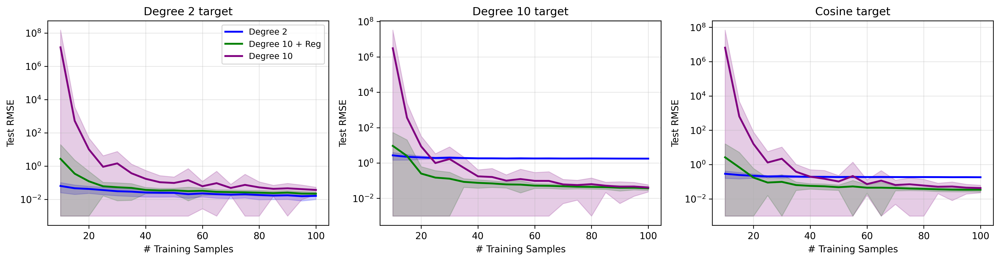

# constraints

[](https://codecov.io/gh/armaank/equiv)
[](https://github.com/astral-sh/ruff)
[](https://github.com/astral-sh/uv)
[](https://www.python.org/downloads/)

Experiments w/ equivariance constraints/soft inductive biases and ml algorithms. Also an exercise in learning Jax

Based on talk from Dr. Andrew Gordon Wilson from June 2025 at LoG NYC meetup.

## Main ideas

- Embrace an expansive hypothesis space w/ softer inductive biases instead of hard restrictions
- Compressibility of solution space goes hand-in-hand with model size (larger models can have more 'efficient' solution spaces than smaller models). This is what makes neural nets unique
- 'Occam's Razor' Bias
- Good q: should we use a different model if we have less/more data? (ans: no, b/c do we think that the data generation process is dependent on the number of samples? obv not)
- For example: in CNNs, instead of explicit parameter sharing that enforces translation invariances, use a softer restriction that encourages
translation parameter sharing but not a hard restriction

## Usage

```bash
# generate toy order dependent regularization example
uv run equiv/main.py

```

## Development

Run tests

```bash
make tests
```

Lint and format code

```bash
make lint
```

### CI

Defined in [`.github/workflows/ci.yml`](.github/workflows/ci.yml). Runs on push to `main` and on pull requests.

- `lint`: ruff check, ruff format, isort
- `test`: pytest with coverage, uploads to codecov

## Results

### Order-Dependent Regularization (Figure 1)



Pretty closely replicates the figures from the talk. Looks like the un-regularized model isn't so bad
when it isn't at the extremas.

### Sample Size Experiment (Figure 2)



Again, pretty close to the figures from the talk. The magnitude of the RMSE isn't as low, but the
relative trends for the different models hold up.

## Papers & References

https://arxiv.org/pdf/2503.02113

https://arxiv.org/pdf/2304.05366 

Very interesting blog post on an exchange between Radford Neal, Andrew Gelman and David MacKay on this topic: https://statmodeling.stat.columbia.edu/2011/12/04/david-mackay-and-occams-razor/

## Notes

- Jax random works differently to numpy due to parallelization concerns
- Jax defaults to float32 whereas numpy defaults to float64, requires `jax_enable_x64` to resolve some overflow issues
